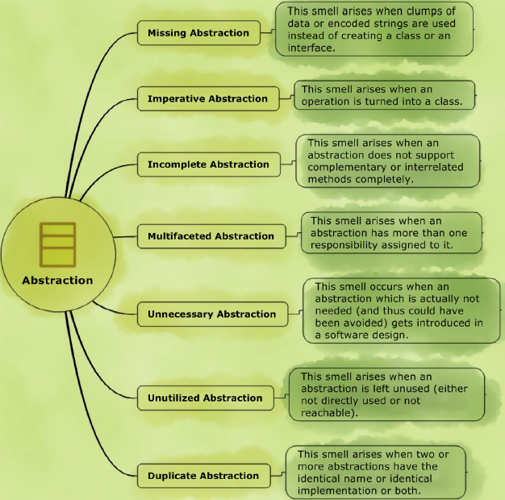
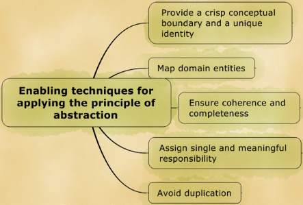

Semua smell di dalam grup ini berkaitan dengan kesalahan dalam mendesain abstraksi.

- [Missing Abstraction](#missing-abstraction)
- [Imperative Abstraction](#imperative-abstraction)
- [Incomplete Abstraction](#incomplete-abstraction)
- [Multifaceted Abstraction](#multifaceted-abstraction)
- [Unnecessary Abstraction](#unnecessary-abstraction)
- [Unutilized Abstraction](#unutilized-abstraction)
- [Duplicate Abstraction](#duplicate-abstraction)


### Prinsip abstraction



Menurut Girish Suryanarayana dkk, terdapat 5 prinsip abstraction yaitu:

- **Provide a crisp conceptual boundary and an identity** - Adanya boundary yang jelas.
- **Map domain entities** - Pemilihan kata yang tepat terhadap domain.
- **Ensure coherence and completeness** - Berikan detail kelas yang selengkap-lengkapnya dan koheren (termasuk pasangan/lawan kata).
- **Assign single and meaningful responsibility** - Hanya memegang 1 tanggungjawab penting dalam 1 class.
- **Avoid duplication** - Hindari duplikat nama atau implementasi dalam abstraksi.

Berdasarkan pada pengamatan abstraction smell, terdapat pelanggaran prinsip abstraction antara lain:

| Abstraction smell | Pelanggaran prinsip abstraction | Penyebab | Martin Fowler smells |
| --- | --- | --- | --- |
| Missing Abstraction | Provide a crisp conceptual boundary and a unique identity | Pemakaian komponen-komponen data/string tanpa membuatkan object class | Primitive Obsession, Data Clumps |
| Imperative Abstraction | Map domain entities | Proses dijadikan class, pemikiran Procedural dalam Object-oriented programming | Lazy Class *(Potentially)* |
| Incomplete Abstraction | Ensure coherence and completeness | Tidak ada pasang/lawan kata domain | - |
| Multifaceted Abstraction | Assign single and meaningful responsibility | Satu class memegang > 1 tanggungjawab | Divergent Changes + Large Class |
| Unnecessary Abstraction | Assign single and meaningful responsibility | Pembuatan class yang seharusnya tidak diperlukan (alias overengineering) | Speculative Generalities |
| Unutilized Abstraction | Assign single and meaningful responsibility | Ada class yang tidak terpakai sama sekali | Dead Code |
| Duplicate Abstraction | Avoid duplication | Ada method/implementasi yang sama antar class | Alternative Classes with Different Interfaces |


## Missing Abstraction

Smell ini terjadi ketika:

- Ada sekumpulan data yang dibiarkan primitif (mirip Data Clumps Martin Fowler).
- Ada encoded string yang dibiarkan primitif (mirip Primitive Obsession Martin Fowler).

Bila smell ini dibiarkan, maka bisa menyebabkan:

- Detail code tersebar dan terekspos di banyak tempat. Menyebabkan tanggungjawab di class yang bersangkutan menjadi tidak jelas (melanggar SRP).
- Terjadi tight-coupling antar class yang memegang data mentah yang tersebar.

### Penyebab Smell

- **Inadequate design analysis**: software developer tidak teliti ketika proses desain. Biasa terjadi karena developer dikejar deadline sehingga terburu-buru dalam melakukan code. Yang penting cepat selesai.
- **Lack of refactoring**: ketika program belum terlalu besar, mungkin saja menggunakan data mentah masih cukup rapi. Seiring berjalannya waktu, ketika ada fitur baru, ternyata data mentah dipakai lagi di tempat lain, dan developer belum sadar bahwa sudah saatnya melakukan refactoring.
- **Misguided focus on minor performance gains**: developer berusaha meningkatkan performance aplikasi, misal dari O(3N+5) menjadi O(2N+3). Ketika performance yang ditingkatkan relatif sedikit, sebaiknya kita lebih fokus kepada code yang rapi. Demi efisiensi bisnis, maintainable code jauh lebih penting ketimbang meningkatkan sedikit performance. Server dan compiler sekarang makin canggih dan murah.

### Contoh

#### Masalah

Terdapat data-data yang berkaitan dengan ISBN (International Standard Book Number).

ISBN adalah kode unik yang dibeli oleh penerbit buku untuk diletakkan di buku terbitannya. Kode unik ini terdiri dari: registration group, registrant, publication dan check digit.

ISBN yang dipakai sekarang ini memiliki 2 bentuk. ISBN-10 (mengandung 10 digit) dan ISBN-13 (mengandung 13 digit). ISBN-10 bisa dikonversi menjadi ISBN-13, dan sebaliknya. Kedua bentuk ini juga punya algoritma tersendiri untuk mengecek apakah kode tersebut valid atau tidak. Detail algoritma konversi dan pengecekan dapat dilihat di [Wikipedia](https://en.wikipedia.org/wiki/International_Standard_Book_Number).

Perhatikan [Book.java](https://github.com/akmalrusli363/smell/master/src/girish/abstraction/duplicate/before/Book.java) pada package before. Terdapat String ISBN yang memiliki behavior pengecekan dan konversi. Behavior ini tentunya bukan merupakan tanggungjawab class Book. String ISBN seharusnya tidak disimpan secara mentah di dalam class ini.

#### Penyelesaian

ISBN diekstrak menjadi hirarki baru. [ISBN.java](https://github.com/akmalrusli363/smell/master/src/girish/abstraction/duplicate/after/ISBN.java) sebagai parent-nya dan diturunkan menjadi [ISBN10](https://github.com/akmalrusli363/smell/master/src/girish/abstraction/duplicate/after/ISBN10.java) dan [ISBN13](https://github.com/akmalrusli363/smell/master/src/girish/abstraction/duplicate/after/ISBN13.java). Agar switch statement lebih rapi, dibuat [ISBNFactory](https://github.com/akmalrusli363/smell/master/src/girish/abstraction/duplicate/after/ISBNFactory.java) untuk digunakan oleh class [Book](https://github.com/akmalrusli363/smell/master/src/girish/abstraction/duplicate/after/Book.java).

### When to Ignore

Smell ini tidak perlu di-refactor bila malah menyebabkan over-engineering.


## Imperative Abstraction

Smell ini terjadi ketika sebuah operasi dibuat menjadi sebuah class, dan di dalam class ini, hanya punya satu method saja.

Sesuai namanya, paradigma OOP: **OBJECT**-oriented programming. Class di dalam OOP wajarnya berupa kata benda. Bukan kata kerja atau kata sifat. Method baru boleh kata kerja. Interface baru boleh kata sifat.

### Penyebab Smell

- **Procedural thinking**: software developer menggunakan paradigma prosedural saat coding paradigma OOP.

### Contoh

#### Masalah

Perhatikan package [before](https://github.com/akmalrusli363/smell/master/src/girish/abstraction/imperative/before). Terdapat class CreateReport, DisplayReport, dan CopyReport. Disini sudah jelas terjadi imperative abstraction karena ketiga class tersebut merupakan kata kerja, bukan kata benda.

#### Penyelesaian

Operasi di dalam DisplayReport dan CopyReport, dipindahkan sebagai method ke dalam class Report. CreateReport dipindahkan sebagai constructor class Report.

### When to Ignore

Smell ini tidak perlu di-refactor bila class memang sengaja dibuat imperatif. Biasa terjadi ketika menerapkan design pattern state, command, atau strategy. Ketiga design pattern ini adalah Gang of Four design pattern, akan dipelajari di semester depan.


## Incomplete Abstraction

Smell ini terjadi ketika ada sebuah method yang secara logika harusnya punya pasangan, namun karena belum ada requirement, developer belum membuat pasangannya.

Contoh pasangan di buku Girish:


### Contoh

#### Masalah

Terdapat method `setAuthor()` di dalam class [Book](https://github.com/akmalrusli363/smell/master/src/girish/abstraction/duplicate/before/Book.java).

Tentunya class ini terlihat aneh karena hanya ada fungsi setter tanpa getter (atau behavior lain yang memanfaatkan string author). Kita tidak pernah mendengar ada [Compact Disc](https://en.wikipedia.org/wiki/Compact_disc) yang write-only, bukan?

#### Penyelesaian

Dilengkapi dengan menambahkan `getAuthor()`.

Contoh lain yang menarik, Suryanarayana et al. mempermasalahkan code di dalam Java: interface [javax.swing.ButtonModel](https://docs.oracle.com/javase/7/docs/api/javax/swing/ButtonModel.html).

Perhatikan methods yang disediakan pada interface ButtonModel. Semuanya berpasangan, misal `setPressed()` berpasangan dengan `isPressed()`. Namun, terdapat method `setGroup()` tidak memiliki pasangan.

Pasangan `setGroup` malah dibuat di class turunannya: [javax.swing.DefaultButtonModel](https://docs.oracle.com/javase/7/docs/api/javax/swing/DefaultButtonModel.html). Terdapat method `getGroup` di class tersebut.

Hal ini aneh, karena idealnya, bila memang kelupaan, `getGroup` langsung ditambahkan di dalam interface ButtonModel. Ini malah dipaksa diselipkan di class turunannya.

Hal ini terpaksa dilakukan Java karena bila mereka menambahkan `getGroup` di interface yang sudah terlanjur di-publish, maka semua programmer yang sedang menggunakan versi Java tersebut akan kalang kabut karena terjadi major changes (major version harus ditambahkan). Biasanya software atau library memiliki versioning setidaknya tiga angka dengan format `major.minor.patch`. Contoh: `1.0.5`. Silakan pelajari perkara versioning lebih detail di [semver.org](https://semver.org/).

### When to Ignore

Bukan termasuk smell bila memang developer **sengaja** menghilangkan pasangannya.

Contohnya, class memang sengaja dibuat hanya punya getter tanpa setter karena atribut read-only.

Contoh lain, pada Java, class dibuat hanya punya constructor saja tanpa destructor karena di Java sudah ada fitur garbage collector. Berbeda bila kita menggunakan bahasa C++, destructor harus dibuat (dan dipanggil) manual.


## Multifaceted Abstraction

Smell ini terjadi ketika ada class yang memiliki lebih dari satu tanggungjawab (violasi SRP).

Smell ini mirip dengan smell divergent change Martin Fowler. Biasanya divergent change disertai juga dengan smell large class.

### Penyebab Smell

- **General-purpose abstractions**: software developer melakukan desain abstraksi yang berujung [God Object](https://en.wikipedia.org/wiki/God_object).
- **Evolution without periodic refactoring**: awalnya class masih langsing, namun seiring bertambahnya fitur, class bertambah tanggungjawab baru. Seharusnya ketika class semakin gemuk, developer sudah saatnya melakukan refactoring.
- **The burden of processes**: developer malas. Menambah method di class yang sudah ada memang lebih mudah ketimbang membuat class baru.

### Contoh

#### Masalah

Perhatikan class [Rectangle](https://github.com/akmalrusli363/smell/master/src/girish/abstraction/multifaceted/before/Rectangle.java) di package `before`. Disana terdapat field `width` dan `weight`. Terdapat method `area()` dan `perimeter()`. Dan juga terdapat method `print(String style)`.

Pada umumnya, domain logic dan presentation logic dipisah. Kita bisa berargumen bahwa class Rectangle memiliki dua tanggungjawab, yaitu mengurus kalkulasi Rectangle dan juga mengatur tampilan Rectangle ke dalam console.

#### Penyelesaian

Kita pindahkan method `print` di class `Rectangle` ke class yang baru. Karena di `print` juga terdapat smell primitive obsession, sekalian kita buatkan struktur baru menggunakan strategy design pattern. Perhatikan hasil refactor-nya di package `after`.


## Unnecessary Abstraction

Smell ini terjadi ketika ada class yang dibuat padahal tidak dibutuhkan.

Smell ini mirip dengan speculative generality Martin Fowler.

### Penyebab Smell

- **Procedural thinking in object-oriented languages**: developer belum terbiasa dengan paradigma OOP sehingga salah dalam melakukan desain class.
- **Over-engineering**: developer membuat desain yang sebenarnya tidak dibutuhkan/overkill, alias sok ide.

### Contoh

#### Masalah

Di package before, terdapat [RedButton](https://github.com/akmalrusli363/smell/master/src/girish/abstraction/unnecessary/before/RedButton.java) dan [BlueButton](https://github.com/akmalrusli363/smell/master/src/girish/abstraction/unnecessary/before/BlueButton.java) yang sebenarnya hanya menentukan background class javax.swing.JButton. Selain menentukan background, kedua class tersebut tidak memiliki behavior lain.

#### Penyelesaian

Terlalu berlebihan bila sampai kita melakukan inheritance hanya untuk membedakan warna. Warna background sudah cukup diwakilkan oleh atribut di dalam JButton yang bisa diatur menggunakan `setBackground()`. Kedua class RedButton dan BlueButton bisa dihapus. Perhatikan [ButtonTest](https://github.com/akmalrusli363/smell/master/src/girish/abstraction/unnecessary/after/ButtonTest.java) di package after.


## Unutilized Abstraction

Smell ini terjadi ketika ada class atau interface yang tidak pernah digunakan di dalam project. Smell ini mirip dengan dead code Martin Fowler.

Suryanarayana et al. menggolongkannya dalam dua jenis:

- Unreferenced abstractions: concrete class yang tidak pernah dipakai.
- Orphan abstractions: interface/abstract class yang tidak pernah diturunkan.

### Penyebab Smell

- **Speculative design**: sama dengan Martin Fowler speculative generality. Developer membuatnya karena spekulasi fitur di masa yang akan datang yang tidak pasti kejadian.
- **Leftover Garbage**: awalnya class masih dipakai. Tapi ternyata setelah beberapa kali mengalami refactoring (untuk mengatasi smell lain), developer tidak menyadari class sudah tidak dipakai lagi.
- **Fear of breaking code**: developer takut menghapus class karena khawatir akan masih dipakai.

### Penyelesaian

Class/interface dihapus.

Untuk kasus public library/framework yang belum mau dinaikkan major version-nya (karena menghapus class = breaking changes), maka Anda bisa menandai class/interface itu sebagai `deprecated`. Dengan menandai `deprecated`, Anda memperingatkan developer lain yang menggunakan library ini, bahwa bagian code tersebut akan dihapus di versi yang akan mendatang.

Di Java, cara menandai `deprecated` adalah tinggal menggunakan annotation `@Deprecated`. Contoh:

```java
@Deprecated
public class Foo {

}
```

Bila menggunakan Eclipse IDE, code yang sudah ditandai `deprecated` akan diberi tanda coret.


### Tambahan

Flag `deprecated` tidak hanya berlaku untuk smell ini saja. `Deprecated` bisa Anda manfaatkan ketika belum mau melakukan major breaking changes untuk refactoring smell apapun.


## Duplicate Abstraction

Smell ini terjadi ketika ada abstraksi (class/interface) yang kembar. Mirip dengan smell `alternative classes with different interfaces` milik Martin Fowler.

Suryanarayana et al. membagi dua jenis:

- **Identical name**: nama mirip, behavior beda. Sebaiknya dipertimbangkan nama lain yang lebih cocok agar tidak ambigu.
- **Identical implementation**: behavior sama. Dipertimbangkan untuk digabung.

### Penyebab Smell

- **Copy-paste programming**: developer melakukan copy-paste di sana-sini yang mengakibatkan class duplikat.
- **Lack of communication**: abstraksi dibuat oleh developer yang berbeda. Karena tidak ada komunikasi antar developer, tidak sengaja ada abtraksi yang duplikat.
- **Classes declared non-extensible**: class dideklarasi tidak bisa di-extends lagi (di Java pakai keyword `final`). Sehingga developer terpaksa melakukan copy-paste code ke class baru.


---

## Catatan Referensi

Repository ini hanyalah rangkuman dari buku Suryanarayana et al. dengan sedikit tambahan informasi lain. Diharapkan mahasiswa juga membaca sumber aslinya pada bab 3 halaman 21 - 60.
