# Hierarchy

[Smell](..) → [Girish Suryanarayana et al. Code Smells](.) → [Hierarchy](#)

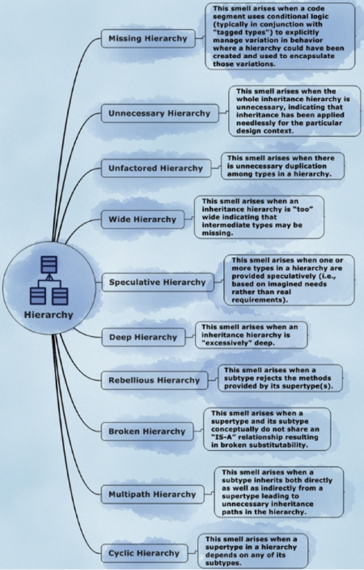

Semua smell di dalam grup ini berkaitan dengan kesalahan dalam merancang hierarki.

- [Missing Hierarchy](#missing-hierarchy)
- [Unnecessary Hierarchy](#unnecessary-hierarchy)
- [Unfactored Hierarchy](#unfactored-hierarchy)
- [Wide Hierarchy](#wide-hierarchy)
- [Speculative Hierarchy](#speculative-hierarchy)
- [Deep Hierarchy](#deep-hierarchy)
- [Rebellious Hierarchy](#rebellious-hierarchy)
- [Broken Hierarchy](#broken-hierarchy)
- [Multipath Hierarchy](#multipath-hierarchy)
- [Cyclic Hierarchy](#cyclic-hierarchy)

### Filosofi

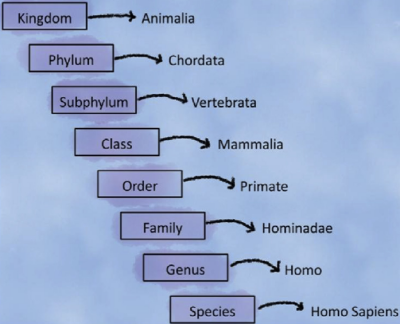

Semua makhluk hidup (baik hewan, tumbuhan, manusia, bakteri, jamur, dan makhluk hidup lainnya) dikelompokkan berdasarkan klasifikasi spesies mulai dari kingdom, filum, class, ordo, family, genus, hingga spesies. Pengelompokkan makhluk hidup (taxonomy) tentunya mempermudah identifikasi makhluk hidup di muka bumi ini, termasuk manusia. Fakta menarik bahwa manusia merupakan spesies makhluk hidup bernamakan *Homo Sapiens*, dimana secara hierarki dapat ditujukan pada gambar diatas, merupakan hewan (bertulang belakang) Mamalia *ordo* Primata yang berevolusi dari saudara-saudara se-ordonya.

Semua ini tentunya merupakan kemajuan dalam dunia biologi berkat [Carl Linnaeus](https://en.wikipedia.org/wiki/Carl_Linnaeus) karena ialah yang merancang pengelompokan makhluk hidup secara taksonomis olehnya.

### Prinsip Hierarchy

[Link Video](https://www.youtube.com/watch?v=FvLtPJzya5o&list=PLG_Cu5FmqSk2KHT6lXngRvcOmOzuk4_ju)

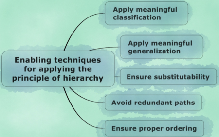

Terdapat 5 prinsip dalam merancang hierarki:

- **Apply meaningful classification**: Terdapat 2 langkah penting dalam mengklasifikasikan suatu hierarki yaitu:
  1. Identifikasi kesamaan dan variasi dari berbagai jenis, temukan kesamaan sebagai superclass dan variasi sebagai subclass.
  2. Golongkan kesamaan dalam superclass/root (tentunya dalam bentuk *abstract class* atau *interface* jika abstraksi superclass berupa template) dan variasi dalam subclass/child/leaves (melalui `extends` atau `implements`).
- **Apply meaningful generalization**: Kelompokkan semua elemen-elemen (behaviour dan elemen) yang sama antar subclass sebagai bagian dari superclass. Generalization tentunya mempermudah pemakaian kembali code sehingga mengurangi jumlah duplikat dalam hierarki class.
- **Ensure substitutability**: Pastikan setiap reference yang diturunkan dari superclass bisa disubstitusi di subclass tanpa mengubah behaviour secara hierarkis alias sesuai dengan prinsip *Liskov’s Substitution (LSP)*. Kasus ini terjadi bila class turunannya melanggar prinsip LSP seperti pada [OO-Abusers - Refused Bequest](Object-Orientation-Abusers#refused-bequest).
- **Avoid redundant paths**: Hindari jalan pintas *inheritance* dikarenakan class turunan "cucu" sudah mengimplementasikan semuanya dari "kakek" hingga "anak" sehingga tidak berguna jika class "cicit" ambil jalan pintas dari kakeknya padahal class tersebut merupakan turunan dari cucu-nya sendiri. _(ya apalagi kalo Tamika sampai nekat ambil jalan pintas dari Kakek Sugiono padahal bapaknya Tamika sendiri adalah anaknya Kakek Sugiono)_
- **Ensure proper ordering**: Pastikan subclass/anaknya bergantung dengan superclass/parentnya, bukan sebaliknya. Jika hal ini terjadi sebaliknya, maka bisa mempersulit dalam reusability *parent class* secara hierarkis.

Berdasarkan pada pengamatan hierarchy smell, terdapat pelanggaran prinsip hierarki antara lain:

| Hierarchy smell | Pelanggaran prinsip hierarchy | Penyebab | Martin Fowler smells |
| --- | --- | --- | --- |
| Missing Hierarchy | Apply meaningful classification | Pemakaian conditional checking untuk menentukan behaviour object yang seharusnya dapat diganti dengan polymorphism | - |
| Unnecessary Hierarchy | Apply meaningful classification | Developer membuatkan subclass hanya karena masalah perbedaan attribute bukan pada perbedaan behaviour | - |
| Unfactored Hierarchy | Apply meaningful generalization | Terdapat duplikat antara sesama saudara subclass atau antar subclass dengan superclass | Duplicate Code (class-to-class) |
| Wide Hierarchy | Apply meaningful generalization | Superclass mempunyai banyak anakan langsung tanpa intermediate class | - |
| Speculative Hierarchy | Apply meaningful generalization | Adanya class yang dibuatkan oleh developer karena alasan spekulatif untuk memenuhi kasus tertentu | Speculative Generalities |
| Deep Hierarchy | Apply meaningful generalization | Pembuatan hierarki terlalu besar dan terlalu dalam subclass levelnya. | - |
| Rebellious Hierarchy | Ensure substitutability | Subclass menolak behaviour dari superclass | Refused Bequest |
| Broken Hierarchy | Ensure substitutability | Hubungan relationship antar superclass dan subclass terputus karena ada pemaksaan hubungan inheritance | Refused Bequest (ISP) |
| Multipath Hierarchy | Avoid redundant paths | Subclass (cucu) mengambil jalan pintas inheritance ke base class | - |
| Cyclic Hierarchy | Ensure proper ordering | Superclass bergantung pada subclass | Feature Envy, Inappropriate Intimacy |


## Missing Hierarchy

[Link Video](https://www.youtube.com/watch?v=Z0gVvdARFWw&list=PLG_Cu5FmqSk2KHT6lXngRvcOmOzuk4_ju) |
[Materi](https://github.com/akmalrusli363/smell/blob/master/src/girish/hierarchy/missing)

> Buat hierarki di bahasa pemrograman itu ya pada intinya buat abstract class/interface, buat class turunannya lalu extend dari abstract classnya, ~~selesai!~~ (bukan begitu!). Jangan lupa untuk memastikan class turunannya tidak ada yang duplikat dan semua method yang dibutuhkan di subclass ditulis di superclass (interface/abstract class).

Smell ini terjadi ketika mayoritas class-class turunannya (subclass) mempunyai method/behaviour yang seharusnya bisa ditempatkan pada superclass sebagai method atau `abstract` method.

Smell ini seringkali disandingkan dengan smell [Switch-statements](OO-Abusers#switch-statements) dikarenakan smell ini identik dengan pemakaian `if-else` atau `switch` statements yang berulang-ulang (termasuk dengan `instanceof` untuk class matching pada object dan typecasting).

### Penyebab

- **Misguided simplistic design & Procedural approach to design**: Developer (minim pengalaman/prosedural) menganggap bahwa pemakaian type value dan conditional statement dapat menyederhanakan desain software.
- **Overlooking inheritance as a design technique**: Developer menganggap inheritance berfungsi lebih ke penambahan variasi desain ketimbang untuk keperluan hierarkis.

### Penyelesaian

Untuk menuntaskan smell tersebut, ada dua cara penyelesaian smell tersebut yaitu:

- Jika smell tersebut terjadi karena kesamaan method, lakukan introduce interface atau extract ke abstract class (superclass) untuk class-class terkait.
- Jika smell tersebut terjadi dimana conditional statements dapat dijadikan class, extract method-method dan member sebagai superclass (abstract/interface) dimana setiap class turunannya mengimplementasikan method-method abstract dari superclass. Teknik ini tentunya akan menjalankan polymorphism method secara langsung pada object variatifnya.

### Contoh

#### Contoh 1: `java.swing.plaf.windows.XPStyle` margin problems

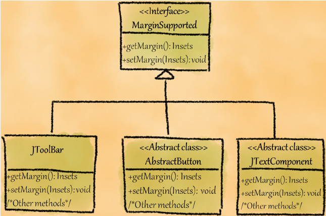

Salah satu kasus yang disinggung oleh Girish adalah masalah margin dari class `java.swing.plaf.windows.XPStyle` dimana terdapat bagian code yang melakukan cek margin dari ketiga komponen tersebut yaitu `AbstractButton`, `JToolBar`, dan `JTextComponent` yang seharusnya dapat dijadikan interface tersendiri pada method `getBorderInsets(Component c, Insets insets)` sebagai berikut:

```java
public Insets getBorderInsets(Component c, Insets insets){
  Insets margin = null;
  //
  // Ideally we’d have an interface defined for classes which
  // support margins (to avoid this hackery), but we’ve
  // decided against it for simplicity
  //
  if (c instanceof AbstractButton) {
    margin = ((AbstractButton)c).getMargin();
  } else if (c instanceof JToolBar) {
    margin = ((JToolBar)c).getMargin();
  } else if (c instanceof JTextComponent) {
    margin = ((JTextComponent)c).getMargin();
  }
  // rest of the code elided ...
}
```

Salah satu penyelesaian dari smell tersebut adalah dengan membuat interface bernama `MarginSupported` yang berisikan method setter dan getter Margin yang akan dipakai oleh ketiga component yaitu `AbstractButton`, `JToolBar`, dan `JTextComponent`.

Meski demikian, developer Java juga mengakui adanya kesalahan yang menyebabkan smell ini terjadi karena masalah tanggungnya developer dan kesederhanaan code.

#### Contoh 2: Player, Monster, and NPC attack problems

Pada kasus dalam package [before](https://github.com/akmalrusli363/smell/tree/master/src/girish/hierarchy/missing/before), terdapat 3 class entity yang menyangkut masalah attack, dimana salah satu classnya yaitu `NPC` adalah entity yang tidak dapat diserang oleh entity lain. Ketika class [GameObject.java](https://github.com/akmalrusli363/smell/tree/master/src/girish/hierarchy/missing/before/GameObject) dijadikan perwakilan atas entity-entity tersebut, penyerangan seharusnya tidak boleh terjadi pada `NPC` karena NPC tidak mempunyai darah.

Di sisi lain, dipergunakanlah class [AttackService.java](https://github.com/akmalrusli363/smell/tree/master/src/girish/hierarchy/missing/before/AttackService.java) untuk menyelesaikan kasus penyerangan NPC, dimana class ini menyangkut adanya conditional checking pada snippet code berikut:

```java
public void hit(GameObject obj, int damage) {
  if(obj instanceof Monster) {
    ((Monster) obj).hit(damage);
  } else if(obj instanceof Player) {
    ((Player) obj).hit(damage);
  }
}
```

Snippet code/method `hit()` tentunya menimbulkan smell karena adanya pemakaian conditional checking yang berulang-ulang pada method tersebut. Sebagai gantinya, pada package [after](https://github.com/akmalrusli363/smell/tree/master/src/girish/hierarchy/missing/after), pemakaian polymorphism dipergunakan untuk menyelesaikan smell tersebut dengan membuat interface [Hittable](https://github.com/akmalrusli363/smell/tree/master/src/girish/hierarchy/missing/after/Hittable.java) yang mengimplementasikan method `hit(int damage)` untuk dipergunakan pada class `Monster` dan `Player` dimana pada class [AttackService.java](https://github.com/akmalrusli363/smell/tree/master/src/girish/hierarchy/missing/after/AttackService.java) dalam package `after`, hanya ada pemanggilan method polymorphism dari method `hit(GameObject obj, int damage)` sebagai berikut:

```java
public void hit(GameObject obj, int damage) {
  if(obj instanceof Hittable) {
    ((Hittable) obj).hit(damage);
  }
}
```

### Julukan

- **Tag class**: Terjadi karena adanya pemakaian tag field (hardcoded variables) untuk cek variasi class.
- **Missing inheritance**: Adanya bagian code yang terindikasi duplikat atau pemakaian “switch-case” statements yang seharusnya digantikan dengan inheritance.
- **Collapsed type hierarchy**: Terjadi karena adanya pemakaian 2 atau lebih conditional check yang digunakan untuk menentukan behaviour.
- **Embedded features**: Terjadi karena adanya pemakaian toggle attribute untuk menentukan behaviour dari class-class lain.

### When to Ignore
Smell ini dapat dibiarkan jika class tersebut difungsikan untuk pemakaian design pattern berbasis Factory class atau untuk keperluan input dari file/user prompts dengan encoding teks/inputan sebagai object dalam Java.


## Unnecessary Hierarchy

[Link Video](https://www.youtube.com/watch?v=hfNd8QPcWDk&list=PLG_Cu5FmqSk2KHT6lXngRvcOmOzuk4_ju) |
[Materi](https://github.com/akmalrusli363/smell/blob/master/src/girish/hierarchy/unnecessary)

> Bagaikan cinta diminang dua.. Tapi jangan sampai dibedain habis-habisan terus namain botol air minum sampai ke urat-uratnya oi (meski botolnya dibeli 3 dari toko yang sama) :joy:! Atau jangan sampai terlalu niat pisahin gula, kopi, sama krimer dari kopi sachetan 3-in-1 terus taruh di toples yang berbeda sesuai kemasan kopinya juga kali :joy:!

Smell ini terjadi ketika pembagian class yang seharusnya dikaitkan dengan perbedaan behaviour, malah dibagikan hingga variasi data-datanya yang seharusnya tidak diperlukan dalam pembagian class. Dalam perbedaan atas data, pembagian class seharusnya tidak perlu dilakukan karena hanya memperbanyak hierarki yang sudah ada dan tentunya cukup dijadikan sebagai member object dalam class.

### Penyebab

- **Subclassing instead of instantiating**: Dimana pembagian class terjadi hingga variasi-variasi data yang seharusnya cukup dilakukan pada deklarasi member/implementasi method abstract. Misal terdapat bunga Mawar yang memiliki 3 warna yang malah dipecahkan sebagai subclass.
- **Taxonomy mania**: Dimana developer terlalu maniak dengan inheritance (alias terlalu memperkarakan perbedaan atribut dari class) sehingga terdapat beberapa class yang seharusnya tidak diperlukan malah ada dalam pembagian class tersebut. Misal terdapat pembagian class dari lampu lalu lintas ataupun perkara jenis kelamin juga dibuatkan class padahal hanya beda jenis kelamin saja.

### Contoh

Salah satu contoh paling sederhana adalah menyangkut adanya pembagian font yang seharusnya tidak diperlukan pada hierarki. Misal terdapat 5 font yang dibuatkan class pada contoh grafis pembagian class:

```
[Font]
  | (generalizes)
  +--[ArialFont]
  +--[CalibriFont]
  +--[ComicSansFont]
  +--[GeorgiaFont]
  +--[TahomaFont]
```

Smell ini seharusnya tidak perlu terjadi bila class `Font` dalam hierarki tersebut tidak dibuatkan subclassnya dan sebaliknya, semua subclass dalam hierarki dapat di-collapse dan ditambahkan private attribute yaitu `fontName` yang berisikan nama font saja.

### Penyelesaian

Sebagai jalan penyelesaian, bagikan class hanya jika pembagian class tersebut terdapat perbedaan secara signitifikan terkait dengan penambahan/perubahan behaviour atau fungsionalitas dari class tersebut.

Dalam menyelesaikan smell tersebut, terdapat 3 cara dalam pembagian class yaitu:

1. Jika pembagian class tersebut menyangkut penamaan atribut, lakukan (Replace Subclass with Fields)[https://sourcemaking.com/refactoring/replace-subclass-with-fields] dengan mengubah subclass menjadi atribut dalam class.
2. Jika pembagian class tersebut menyangkut masalah penggolongan dan dapat diselesaikan dengan Enumeration, ubah pembagian class tersebut menjadi Enumeration.


### Julukan

- **Taxomania**: Adanya pembagian class yang seharusnya tidak diperlukan dan dapat digantikan dengan input parameter yang berisikan attribute.
- **Object classes**: Adanya subclass yang seharusnya tidak diperlukan dan dapat ditempatkan sebagai atribut dalam class.

### When to Ignore


Dalam kasus design pattern yaitu [State Design Pattern](https://sourcemaking.com/design_patterns/state), jika class tersebut dibagikan demi alasan perpindahan state maka smell tersebut dapat diabaikan dengan catatan terdapat abstract method yang dapat mengatur perpindahan object antar class.


## Unfactored Hierarchy

[Link Video](https://www.youtube.com/watch?v=IJFO8YlSosc&list=PLG_Cu5FmqSk2KHT6lXngRvcOmOzuk4_ju) |
[Materi](https://github.com/akmalrusli363/smell/tree/master/src/girish/hierarchy/unfactored)

> Alkisah terdapat seekor sapi, kambing, dan domba yang sama-sama merupakan hewan ternak. Ketiga hewan itu sama-sama mempunyai 4 kaki, sama-sama makan rumput, dan sama-sama menghasilkan susu. Namun peternak tersebut menuliskan kesamaan dalam memakan rumput dan menghasilkan susu sebagai hal yang berbeda dalam katalog peternakan sehingga para peternak yang membaca hal tersebut memang terkadang memperlama bacaan katalog yang dikarangnya hingga disadari bahwa teknik memakan rumput dan produksi susu ternyata sama saja.
>
> Tentunya pembaca katalog tentunya kurang senang jika waktu yang dihabiskan untuk membaca katalog terbuang sia-sia karena membaca kesamaan yang dibedakan oleh sang pengarang bukan? Jika kesamaan tersebut cukup dituliskan dalam kesamaan hewan ternak, mengapa tidak disederhanakan saja *pak ternak* :disappointed_relieved:?

Smell ini terjadi pada class-class dalam hierarki dimana terdapat bagian code yang duplikat. Duplikasi code bisa terjadi pada class yang bersaudaraan ataupun pada code-code yang mirip antar superclass dan subclass.

Terdapat 3 jenis smell yang terjadi pada hierarki yaitu:

- **Unfactored interface**: Terdapat public method yang mempunyai kemiripan pada signature (parameter/return type) yang seharusnya dapat ditempatkan pada superclass.
- **Unfactored implementation**: Terdapat method yang mempunyai kemiripan pada implementasi/behaviour yang seharusnya dapat ditempatkan pada superclass.
- **Unfactored interface and implementation**: Terdapat method yang mempunyai kemiripan pada signature (parameter/return type) dan implementasi/behaviour yang seharusnya dapat ditempatkan pada superclass.

### Penyebab

- **Copying subtypes**: Developer melakukan copy-paste isi method dari 1 subclass ke subclass lain karena dikejar deadline dan cepat selesai.
- **Improper handling of outliers**: Adanya masalah yang menyangkut hierarki dimana salah satu member class tidak menginginkan adanya method yang diturunkan dari parentnya (karena dikhawatirkan akan menimbulkan smell Rebellious Hierarchy), sehingga diselesaikan dengan melakukan copas isi method dari satu subclass ke subclass lain yang membutuhkannya.

### Penyelesaian

Jika masalah tersebut menyangkut adanya duplikat dari code-code antar class, terdapat 2 skeneario penyelesaian smell ini yaitu:

- Jika isi snippet code duplikat tersebut menyangkut minor behaviour pada beberapa class, disarankan untuk move/extract code snippet yang duplikat (terjadi antar subclass) ke method baru di class lain.
- Jika isi snippet code duplikat tersebut mirip secara keseluruhan dapat dipindahkan ke superclass, lakukan [pull-up method](https://sourcemaking.com/refactoring/pull-up-method)/[field](https://sourcemaking.com/refactoring/pull-up-field) ke superclass agar dapat dijadikan method konkrit secara langsung.

### Contoh

Salah satu masalah smell paling sederhana adalah masalah hierarki antar dua atau lebih subclass yang menyangkut 1 atau lebih method yang seharusnya dapat di-*pull up* (alias diimplementasikan abstract method di superclass) malah dibiarkan begitu saja dalam keadaan duplikat.

Namun pada kasus hierarki class entity dan game system dimana class tersebut menyangkut adanya duplikasi code snippet antar class pada class [Monster.java](https://github.com/akmalrusli363/smell/tree/master/src/girish/hierarchy/unfactored/before/Monster.java) dan [Player.java](https://github.com/akmalrusli363/smell/tree/master/src/girish/hierarchy/unfactored/before/Player.java) dimana terdapat kesamaan pada bagian code pada method implementasi `hit(int damage)` pada bagian berikut:

```java
// Monster.java
@Override
public void hit(int damage) {
  health -= damage;
  if(health <= 0) {
    die();
  }
}

// Player.java
@Override
public void hit(int damage) {
  double damageMultiplier = (1-((0.052*armor)/(0.9+0.048*Math.abs(armor))));
  if(damageMultiplier < 0) damageMultiplier = 0;

  health -= (damage * damageMultiplier);
  if(health <= 0) {
    die();
  }
}
```

Dimulai dari setting variabel `health -= damage` hingga validasi health point terjadi duplikat dimana terdapat kesamaan isi code kecuali pada pengurangan variabel dengan `damage` yang berbeda pada kedua class. Kesamaan code tersebut jika ditunjukkan maka dapat diekstrak ke private method baru bernama `reduceHealth(int damage)` yang ditempatkan di abstract class baru bernama [GameUnit.java](https://github.com/akmalrusli363/smell/tree/master/src/girish/hierarchy/unfactored/after/GameUnit.java)

```java
protected void reduceHealth(int damage) {
  health -= damage;
  if(health <= 0) {
    die();
  }
}
```

Class baru bernama `GameUnit` akan menampung semua kebutuhan yang diperlukan pada entity-entity yang dapat dilibatkan dalam petempuran seperti class `Player` dan `Monster`. Entity-entity yang mempunyai behaviour health point dapat diextend dari abstract class `GameUnit` dimana abstract class tersebut mengimplementasikan interface `Hittable` (dari smell sebelumnya) sehingga subclass tidak perlu lagi mengimplementasikan interface `Hittable` ke subclass masing-masing.

### Julukan

- **Orphan sibling method/attribute**: Terdapat member yang lebih dari 50% atau minimal 10 subclasses langsung, tanpa adanya penurunan/inheritance dan pemakaian abstract method atau overriding.
- **Incomplete inheritance**: Adanya kemiripan antar subclass dan sesaudaranya dimana isi dari implementasi tersebut hampir sama persis.
- **Repeated functionality**: Duplikat code yang terjadi pada 2 atau lebih class yang seharusnya dapat diabstrakkan.
- **Redundant variable declaration**: Ada subclass yang melakukan inheritance dengan jalan pintas ke base classnya.
- **Significant sibling duplication**: Adanya kesamaan yang mirip antar saudara-saudara subclassnya.

### When to Ignore

Jika bahasa pemrograman tersebut tidak mendukung beberapa hal-hal yang dapat mempermudah programmer menyelesaikan masalah hierarki baik menyangkut multiple class inheritance (Java dan C#) dan Generic type class, maka smell ini terpaksa harus dibiarkan karena menyangkut adanya masalah support dalam bahasa pemrograman berbasis OOP.


## Wide Hierarchy

[Link Video](https://www.youtube.com/watch?v=7pyZYGDz54w&list=PLG_Cu5FmqSk2KHT6lXngRvcOmOzuk4_ju) |
[Materi](https://github.com/akmalrusli363/smell/tree/master/src/girish/hierarchy/wide)

> Sebuah game studio sedang membuat game riding sepeda motor bernama "Motomoria", dimana rider dapat memilih berbagai macam jenis sepeda motor di Indonesia dimulai dari motor bebek, motor sport, motor scooter, dan motor touring. Pada suatu hari, salah seorang Product Owner menanyakan salah seorang kolektor motor, dimana ia mengaku mengoleksi motor-motor moge dari berbagai merek. Namun sayangnya, ketika ia menanyakan jenis-jenis yang ia miliki, ia langsung menuliskan nama motor yang ia miliki tanpa menuliskan kategori sepeda motor tersebut. Malahan kolektor itu bilang semua karakteristik motor itu mirip-mirip (dijawab sesederhana mungkin meski banyak karakteristik yang berbeda dari sepeda motor yang ia miliki).
>
> Hmmm.. Jadi membingungkan jika developer game "Motomoria" harus menuliskan semua koleksi sepeda motor tanpa kategorisasi jenis sepeda motor, dan kalau ada sepeda motor lain yang bisa dicantumkan kan harus copas lagi dari motor-motor yang mirip jenisnya :confused:?

Smell ini terjadi ketika suatu hierarki inheritance terlalu banyak subclass tanpa disertai dengan adanya intermediate class (alias class penengah) dimana pada kasus ini diindikasikan dengan banyaknya duplikat code di class saudara-saudaranya dan minimnya generalization yang diterapkan. Tanpa/minimnya generalisasi, smell ini bisa menjadi tanda bahaya besar karena smell ini menyangkut:

- Banyaknya duplikat karena adanya harus copy-paste dari subtype lain.
- Minimnya intermediate class memaksakan client untuk memakai subclass langsung yang telah ada sehingga tidak fleksibel dalam pengaplikasian hierarki.

### Penyebab

- **Ignoring generalization**: Developer kurang mengerti seberapa pentingnya generalization dalam hierarki sehingga developer membuatkan subclass langsung dari superclass tanpa mempedulikan adanya perpaduan behaviour yang bisa dipakai oleh subclass lainnya.
- **Lack of refactoring**: Developer malas melakukan refactoring sehingga code dibiarkan *burik-burik/jorok* begitu saja.

### Penyelesaian

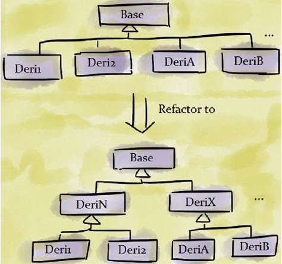

Smell wide hierarchy dapat diselesaikan dengan melakukan introduce intermediate class (baik abstract class turunan superclass maupun interface).

### Contoh

#### Contoh 1: Kasus class `java.util.EventObject`


Dalam buku Girish, ia menyinggung salah satu hierarki class bernama `java.util.EventObject` dimana pada class tersebut terdapat banyak turunan dimana salah satu tiga subclass yang mempunyai penamaan behaviour yang mirip yaitu `TreeExpansionEvent`, `TreeModelEvent`, dan `TreeSelectionEvent`.

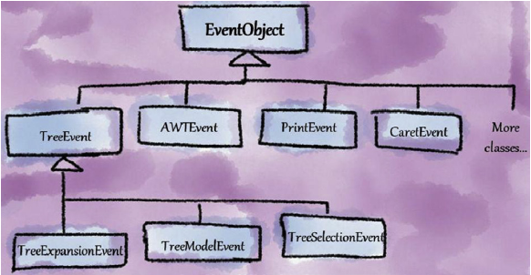

Smell ketiga subclass tersebut kemudian diselesaikan dengan melakukan introduce intermediate class bernama `TreeEvent` dimana class ini merupakan subclass dari `EventObject` dan superclass dari ketiga class tersebut yang berisikan behaviour dari tree.

#### Contoh 2: Kasus game environment Tree dan Stone

Sebaliknya pada kasus game environment (package [before](https://github.com/akmalrusli363/smell/tree/master/src/girish/hierarchy/wide/before)), terdapat 2 subclass dari [GameObject.java](GameObject.java) yaitu [Tree.java](Tree.java) dan [Stone.java](Stone.java) yang mempunyai salah satu method yang behaviournya mirip yaitu `destroy()`. Kedua subclass tersebut seharusnya mempunyai intermediate class yang berperan atas object-object seperti pohon dan batu yaitu `Environment`.

```java
public class Stone extends GameObject {
  public void destroy() {
    //drop barang
  }
  //...
}

public class Tree extends GameObject {
  public void destroy() {
    //drop barang
  }
  //...
}
```

Sebagai jalan penyelesaiannya, class [Environment.java](Environment.java) dibuat untuk menyelesaikan smell wide hierarchy dikarenakan adanya kemiripan behaviour dari class `Stone` dan `Tree` dengan menghadirkan abstract method `destroy()` untuk diaplikasikan pada `Stone` dan `Tree` dan class tersebut berbasiskan dari class `GameObject` sehingga ketika ada class lain yang dibuat mempunyai behaviour yang mirip dengan tree dan stone dapat diextend dari abstract class `Environment` sehingga tidak perlu extend lagi dari `GameObject`-nya.

### Julukan

- **Wide inheritance hierarchy**: This smell occurs when a superclass has more than four direct subclasses.
- **Missing levels of abstraction**: This smell occurs when levels of class abstraction are missing (in other words, more expansion of levels is needed near the root of the hierarchy).
- **Coarse hierarchies**: This smell occurs when a hierarchy has large number of members in a few classes instead of spreading the members among a set of intermediate ancestor classes.
- **Getting away from abstraction**: This smell occurs when number of operations added by a subclass is very high suggesting that some intermediate classes between the subclass and its superclass could be missing.


### When to Ignore

Kedua adalah kasus pemakaian `interface` di Java/C# untuk keperluan protokol generic seperti serialization yang dapat dipakai oleh class-class lain sehingga tidak dianggap memiliki smell Wide Hierarchy.


## Speculative Hierarchy

[Link Video](https://www.youtube.com/watch?v=WaI-tpREgd8&list=PLG_Cu5FmqSk2KHT6lXngRvcOmOzuk4_ju) |
[Materi](https://github.com/akmalrusli363/smell/tree/master/src/girish/hierarchy/speculative)

> Sungguh indah waktunya untuk main game GeTeA.. Developer BintangBatu membuatkan game sekuelnya, GeTeA 6 dimana player dapat mencoba untuk naik mobil, motor, pesawat, kapal, hingga helikopter. Namun pada suatu momen, developer juga tak lupa menyertakan kategori yang diancang-ancangnya, mobil terbang dan motor terbang. Keduanya ini memang ia sengaja buatkan kosong supaya di waktu yang akan datang developer dapat langsung mengerjakannya tanpa harus mengubah dan merekonstruksikan hierarki dari awal. Lalu developer juga bilang, ini class bisa dijadikan placeholder bagi modder untuk mod game dengan koleksi yang modder mau.
>
> Memang yang akan menjadi pertanyaan adalah.. penting gak sih buat kosongan untuk mobil terbang dan motor terbang meski developer janjian agar game ini bisa di-mod dan modder dapat mengisikan kosongannya dengan hal-hal yang modder senangi di situ :confused:?

Smell ini terjadi terdapat beberapa class dalam hierarki yang dibuat karena alasan spekulatif, alias adanya class yang dibuat untuk keperluan sewaktu-waktu fitur tersebut akan ada di waktu yang akan mendatang (dimana terdapat beberapa requirement yang dibuat atas imajinasi developer sendiri). Smell ini tentunya sama dengan smell [Speculative Generalities](Disposables#Speculative-Generalities).

Salah satu prinsip extreme programming (XP) yang terkenal adalah [You aren't gonna need it (YAGNI)](https://en.wikipedia.org/wiki/You_aren%27t_gonna_need_it). Disarankan oleh XP untuk tidak menambahkan fungsionalitas sampai benar-benar diperlukan.

Smell ini tentunya melanggar prinsip YAGNI (“You Ain’t Gonna Need It”) yang seumur-umur tidak akan pernah terpakai apalagi diperlukan dalam requirement.

### Penyebab

- **Future-proofing**: Developer terlalu prediktif dengan pembuatan software yang dapat mengakomodir penggunaan class-class yang terpakai di waktu yang akan datang.
- **Over-engineering**: Developer terlalu nafsu melakukan generalisasi dimana kasus tersebut seharusnya tidak diperlukan dalam requirement.

### Penyelesaian

Jalan paling cepat dalam menyelesaikan speculative hierarchy adalah dengan [Collapse Hierarchy](https://sourcemaking.com/refactoring/collapse-hierarchy) dimana class dan hierarki yang terindikasi spekulatif dibuang dan jika ada hierarki yang terpakai digabungkan dengan hierarki utama.

### Contoh

#### Contoh 1: Blogging Annotation speculatives

Misal dalam pembuatan software berbasis web yang dapat mengakomodir pembuatan blog, terdapat 2 jenis anotasi blog yang dapat dilakukan dalam melakukan blogging yaitu `HTML`, `Wordpress style` yang tentunya tertulis dalam requirement.

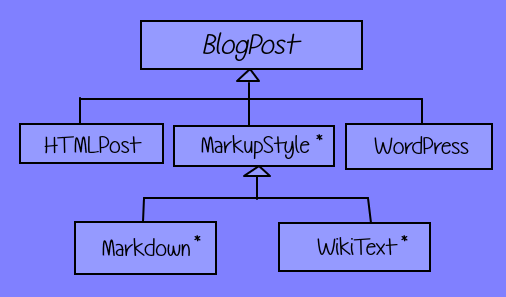

Pada mula-mulanya, developer menyajikan kedua fitur tersebut dalam implementasi pembuatan post namun lama kelamaan, developer meramal akan ada anotasi baru dalam melakukan blogging yaitu `Markdown` dan `Wiki markup` sehingga developer membuatkan class spekulatif ke dalam hierarki, tak lupa dengan intermediate classnya, `MarkupStyle` untuk mengakomodir kebutuhan markup languages (bertanda bintang).

Lama kelamaan, ramalan markup dalam blogging tersebut ternyata belum pernah terjadi dan terabaikan begitu saja hingga sekarang dan akhirnya, smell Speculative Hierarchy malah terjadi karena adanya class yang dipersiapkan untuk keperluan di masa yang akan mendatang namun tidak pernah terpakai sama sekali.

")

Sebagai gantinya, lakukan [Collapse Hierarchy](https://sourcemaking.com/refactoring/collapse-hierarchy) dengan buang hierarki `MarkupStyle` beserta class-classnya sehingga hierarki bersih dari class-class spekulatif.

#### Contoh 2: Digital Currency speculatives

Dimabil dari kasus smell Martin Fowler yaitu [Speculative Generalities](Disposables#Speculative-Generalities), terdapat kasus dimana terdapat 2 mata uang yaitu `USD` dan `IDR` dalam requirement namun programmer berspekulasi bahwa IDR dan USD adalah kurs jenis tradisional, nantinya akan ada kurs jenis digital seperti bitcoin. Oleh karena itu, Programmer membuat hirarki seperti di dalam [package `before`](https://github.com/akmalrusli363/smell/tree/master/src/girish/hierarchy/speculative/before).

Sebagai jalan penyelesaiannya, lakukan [Collapse Hierarchy](https://sourcemaking.com/refactoring/collapse-hierarchy) dengan menghapus intermediate class `Traditional` dan `Digital`, sehingga class `USD` dan `IDR` menjadi turunan langsung dari class `Currency`.

### Julukan

- **Extra sub-class**: Terdapat abstract base class yang diextend oleh hanya 1 subclass saja.
- **Speculative general types**: Terdapat sebuah superclass yang mempunyai 1 subclass dimana fitur yang dikerjakan tidak pernah terpakai sama sekali.
- [**Speculative generality**](Disposables#Speculative-Generalities): Smell ini terjadi karena programmer membuat class dengan alasan spekulatif yaitu meramal pemakaian class di waktu yang akan mendatang.
- **List-like inheritance hierarchies**: Dalam hierarki terdapat beberapa class yang dipersiapkan untuk keperluan spekulatif, seolah-oleh berisikan list kosong dalam hierarki.


## Deep Hierarchy

[Link Video](#) |
[Materi](#)

> Ceritanya dalam game "Life Society", dikisahkan jika kita sebagai masyarakat (tujuan utamanya adalah sebagai sarana sosialisasi) bisa memelihara hewan peliharaan mulai dari anjing, kucing, hamster, dan kelinci. Namun pada saat developer mengerjakan bagian hewan, hierarki yang dikerjakan ternyata sangat dalam bahkan melebihi hierarki karakter player sendiri. Bayangin, hierarki kucing aja terbagi atas berbagai sub-behaviour berdasarkan jenis belum lagi dengan anjing, kelinci, hamster, dan hewan peliharaan lainnya :cat::dog::hamster::rabbit:!
>
> Malah jadi kepikiran lagi, ini kita main game "Life Society" biar bisa gaet banyak orang atau malah pengen jadi kolekor hewan peliharaan? :joy::joy_cat:

Smell ini hampir sama dengan Speculative Hierarchy, namun smell ini masih mempunyai pemakaian class dan inheritance yang terjadi dalam hierarki. Smell ini terjadi karena hierarki dibuat terlalu dalam dikarenakan terlalu banyaknya inheritance maupun terlalu banyak intermediate class karena generalisasi yang berlebihan.

Smell ini tentunya melanggar aturan hierarki yaitu "Apply meaningful generalization" dimana pada smell ini terlalu banyak generalisasi yang diaplikasikan pada hierarki sehingga menimbulkan adanya superclass yang seharus tidak perlu dipecahkan.

### Penyebab

- **Excessive focus on reuse**: Developer terlalu nafsu keberadaan generalization yang mempermudah developer untuk memanfaatkan kembali code tersebut untuk dipakai oleh class lain.
- **Speculative generalization**: Developer menambahkan supertype terlalu banyak demi keperluan di waktu yang mendatang agar supertype tersebut dipakai. Namun kenyataannya, penambahan superclass yang berlebihan menyebabkan hierarki tersebut semakin dalam.

### Penyelesaian

- **Collapse Hierarchy**: Jika ada class yang mempunyai member yang dapat diaplikasikan namun hanya diturunkan pada class bawahannya saja, lakukan collapse hierarchy dengan mengabungkan class tersebut ke superclass/subclass.
- **Replace class as annotation**: Jika pada class tersebut merupakan class kosong, kita dapat mengubah class kosongan sebagai annotation untuk diaplikasikan oleh subclassnya.

### Contoh

Misal pada sebuah hierarki dalam game MineBlock bernama `Entity` yang terdiri atas `Particle`, `Mob (Creature)`, dan `Projectile` dimana masing-masing class mempunyai subclass yang memiliki peran yang berbeda hingga pada tingkatan creature.

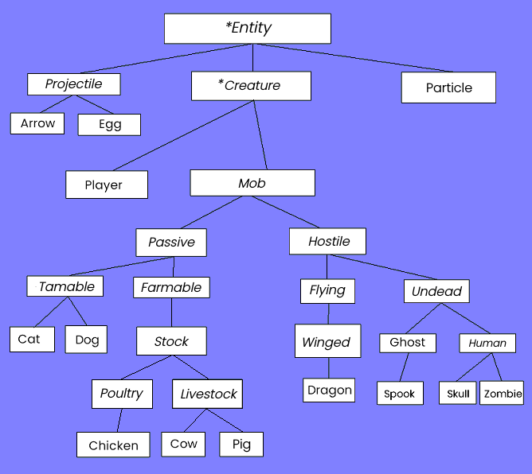

Pada kasus ini disebutkan bahwa dalam pengelompokkan hierarki pada bagian creature terdapat intermediate type yang seharusnya tidak perlu dibuatkan yaitu:

- `Farmable->Stock->(Livestock->(Cow, Pig), Poultry->(Chicken))`
- `Flying->Winged->(Dragon)`
- `Undead->((Ghost->Spook), (Human->(Skull, Zombie)))`

Dimana pada ketiga intermediate type tersebut seharusnya dapat dicollapse alias disatukan sebagai class tersendiri untuk mencegah adanya speculative hierarchy meski class tersebut meliputi adanya member yang dapat dipisahkan demi keperluan tambahan creature baru di waktu yang akan mendatang.

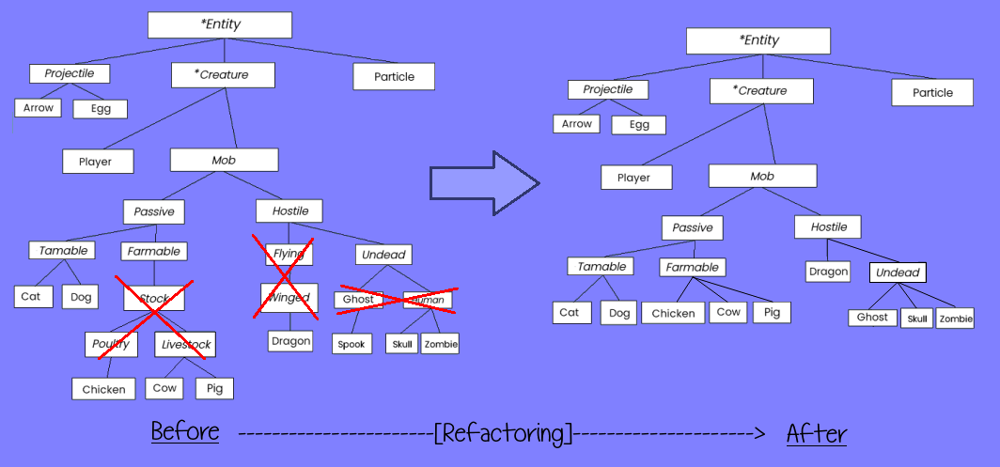

### Julukan

- **Distorted hierarchy**: Smell ini terjadi ketika inheritance hierarchy terlalu dalam dan ramping *(too narrow and deep)*.

### When to Ignore

Pada kasus Framework dan Library, hierarchy tersebut sengaja dibuat cukup dalam diciptakan untuk mempermudah pemakaian kembali oleh class lain, terutama bagi pemakai framework dan library.


## Rebellious Hierarchy

[Link Video](#) |
[Materi](#)

> Ada banyak jenis air putih yang bisa diminum secara langsung mulai dari air mineral, air soda, air isotonik, hingga minuman alkohol. Namun ada satu kejadian ketika seseorang **hampir meminum botol air putih AWUA** yang ternyata **berisikan air aki**, padahal **air ini tidak boleh dikonsumsi** dikarenakan membahayakan kesehatan dan tentunya mengandung asam sulfat yang tinggi! Kan bahaya bisa *mati alias meninggal alias wafat alias Innalilahi* kalo sampai keminum air aki yang dikira air putih?? :scream::coffin:
>
> Saya sih bilang ini terlalu tega ke orang yang membuat kebingungan orang lain dari **air AWUA isi air aki** yang dikira isinya air AWUA beneran!

Smell ini hampir sama dengan smell [Refused Bequest](Object-Orientation-Abusers#refused-bequest) dimana pada smell ini lebih merujuk pada pelanggaran Interface Segregation Principles (ISP) dimana terdapat penolakan warisan antar supertype dengan subtype baik dengan exception, null, ataupun dibiarkan kosong begitu saja.

Object konteks yang dilanggar pada smell ini ada pada pembagian method Interface yang tidak sesuai sehingga terdapat beberapa class yang berani melanggar bahkan menolak inheritance dari interface tersebut.

### Penyebab

- **Creating a hierarchy rooted in an existing concrete class**: Pembuatan hierarki dari class yang salah (terutama concrete class) menyebabkan smell dimana satu/lebih class menolak inheritance yang seharusnya tidak terjadi dalam inheritance.
- **Creating "swiss-knife" types**: Developer menciptakan supertype yang menyediakan segala macam kebutuhan, yang terkadang tidak terpakai bahkan ditolak oleh beberapa class tertentu.

### Penyelesaian

Ada dua cara penyelesaian kasus smell rebellious hierarchy, yaitu:

- Jika method tersebut terpakai pada subtype tertentu, gunakan [move method](refactoring.guru/move-method) untuk memindahkan method ke subclass yang diinginkan.
- Jika method tersebut ditolak oleh beberapa subtype saja, lakukan introduce intermediate class untuk menurunkan method yang terpakai pada class tertentu dan pindahkan inheritance ke intermediate class tersebut.
- Jika method tersebut ditolak oleh semua subtype, buang method dari supertype.

### Contoh

Salah satu kasus dimana terdapat interface `Shape` dimana interface ini berisikan method-method yang akan dipakai oleh object geometri.

```java
public interface Shape {
  public int luas();
  public int keliling();
  public int volume();
}

public class Rectangle implements Shape {
  int w, h;

  @Override
  public int luas() {
    return w * h;
  }

  @Override
  public int keliling() {
    return 2 * (w + h);
  }

  @Override
  public int volume() {
    throw new UnsupportedMethodException("Not implemented yet!");
  }
}

public class Cube extends Shape {
  int l, w, h;

  @Override
  public int luas() {
    return 2 * (l * w + l * h + w * h);
  }

  @Override
  public int keliling() {
    return 4 * (l + w + h);
  }

  @Override
  public int volume() {
    return l * w * h;
  }
}
```

Pada contoh code tersebut, terdapat pelanggaran dimana class `Rectangle` harus menerima method-method penghitung volume padalah objek geometri tersebut berupa 2 dimensi, sehingga class tersebut menolak method `volume` dikarenakan sifat dua dimensi yang dimilikinya. Sebaliknya, pada class `Cube`, semua method dalam interface tersebut terimplementasi dengan baik tanpa hambatan.

Lain halnya dengan interface yang memang dibuatkan sebagai fondasi atas object geometri yang akan diaplikasikan kepada class-classnya.

Sebagai penyelesaiannya, pecahkan interface menjadi 2 bagian, yaitu `Shape2D` dan `Shape3D` sehingga class `Rectangle` dapat menerima inheritance yang seharusnya tanpa harus menolak method-method lainnya.

```java
public interface Shape2D {
  public int luas();
  public int keliling();
}

public interface Shape3D implements Shape2D {
  public int volume();
}

public class Rectangle implements Shape2D {
  int w, h;

  @Override
  public int luas() {
    return w * h;
  }

  @Override
  public int keliling() {
    return 2 * (w + h);
  }
}

public class Cube extends Shape3D {
  int l, w, h;

  @Override
  public int luas() {
    return 2 * (l * w + l * h + w * h);
  }

  @Override
  public int keliling() {
    return 4 * (l + w + h);
  }

  @Override
  public int volume() {
    return l * w * h;
  }
}
```

Jika ada method tambahan yang perlu ditambahkan pada interface dan class implementasi memerlukan rumus khusus yang tidak diperuntukkan pada class lainnya, maka method baru dapat ditambahkan di interface turunannya dengan keyword `implements`.

### Julukan

- [**Refused Bequest**](Object-Orientation-Abusers#refused-bequest): Smell ini terjadi karena penolakan inheritance dari subtype terhadap supertype. Smell ini dapat melanggar Interface Segregation Principle (ISP) maupun Liskov Substitution Principle (LSP) dalam object konteks method yang dilanggarnya.
- **Refused parent bequest**: Subclass menurunkan interface method secara private atau menurunkan method tanpa behaviour.
- **Naughty children**: Subclass tidak mau menerima method yang diterima dari superclass.
- **Premature interface abstraction**: Jumlah method dalam inheritance terlalu banyak sehingga tidak semua class turunannya menerima method tersebut.

### When to Ignore

#### Yet-to-be implemented functionality

Pada kasus ini salah satu class turunannya sengaja mengosongkan method yang diterima dari abstract class karena keterbatasan waktu/akan dikerjakan di lain hari.

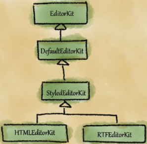

Salah satu contohnya adalah class `javax.swing.text.rtf.RTFEditorKit`, dimana pada class tersebut terdapat method `write()` yang diturunkan dari `EditorKit` ditolak dengan melemparkan `IOException` dengan alasan karena masalah keterbatasan waktu.

```java
public void write(Writer out, Document doc, int pos, int len) throws IOException, BadLocationException {
  throw new IOException(“RTF is an 8-bit format”);
}
```

#### Performance considerations

Beberapa hierarchy class terkadang memiliki class dimana class tersebut menolak beberapa method inheritance dari parentnya dengan alasan performa sehingga method dalam class tersebut dibiarkan kosong begitu saja.

Salah satu contoh kasusnya adalah hierarki class `java.swing.JLabel` terhadap class turunannya, `DefaultListCellRenderer`, `DefaultTableCellRenderer`, dan `DefaultTreeCellRenderer` dimana ketiga class tersebut menolak kelima method yaitu `invalidate()`, `validate()`, `revalidate()`, `repaint()`, `isOpaque()`, dan `firePropertyChange()` dengan membiarkannya kosong dengan alasan sebagai berikut:

> “Implementation Note: This class overrides invalidate, validate, revalidate, repaint, isOpaque, and firePropertyChange solely to improve performance. If not overridden, these frequently called methods would execute code paths that are unnecessary for the default list cell renderer. If you write your own renderer, take care to weigh the benefits and drawbacks of overriding these methods.”

Hal itu tentunya ditujukan dengan segi performance karena method yang dipanggil dari Default Renderer tidak berguna pada renderer tersebut sehingga mengosongkan method yang diturunkan dapat menghemat resources dari ketiga class tersebut.

#### Avoiding complex design

Pada beberapa kasus smell hierarki ini, disebutkan bahwa terdapat beberapa class yang sengaja membiarkan method tersebut kosong ataupun ditolak dengan berbagai cara memang telah dipertimbangkan sedemikian rupa agar tidak terjadi ledakan class seperti yang direferensikan pada smell [Missing Encapsulation](Encapsulation#missing-encapsulation).

Beberapa class dalam Java, terutama class `UnmodifiableList` dan `UnmodifiableMap` dalam JDK7 sengaja menolak ketiga method dengan kemampuan merubah List dan Map yaitu `add()`, `set()`, dan `remove()` dengan pertimbangan dari designer dan developer yaitu untuk mencegah ledakan class dan interface dalam JDK ketika class tersebut dikelola lebih jauh lagi.


## Broken Hierarchy

[Link Video](#) |
[Materi](#)

> POKOKNYA KITA BERDUA CERAI HARI INI JUGA :broken_heart:! Udah capek-capek pasangan suami-istri ingin punya anak, eh.. diceraikan dan anaknya gak boleh tahu dosa-dosanya suami-istrinya sendiri! Kan tega sampai bikin anaknya gak mau tahu sama orang tuanya sendiri dan ujung-ujungnya durhaka sama orang tua sendiri!

Smell ini terjadi karena hubungan antar superclass dengan subclass yang tidak bersifat **`is-a`** yang mengakibatkan hubungan hierarki tersebut terputus.

Ada tiga jenis broken hierarchy:

1. Hubungan superclass dan subclass yang seharusnya **`is-a`** (yang dapat diturunkan dengan keyword `extends` atau `implements`) malah diubah relasinya sebagai **`has-a`** sehingga relasi antar kedua class terputus.
2. Hubungan base class dengan implementer yang seharusnya **`has-a`** (hubungan delegatif/aggregates) malah dipaksakan untuk berelasi sebagai **`is-a`** (inhertied superclass-subclass).
3. Hubungan base class dan subclass yang terbalik, sehingga terdapat hierarki yang seharusnya tidak mendapatkan peran yang seharusnya malah harus menerimanya.

### Penyebab

- **Inheritance for implementation reuse**: Inheritance dipakai untuk penerapan reusability untuk menurunkan method-method supertype melalui hubungan **`is-a`** namun dengan cara yang salah.
- **Incorrect application of inheritance**: Penerapan inheritance yang salah bahkan dipaksakan menyebabkan hubungan relasi antar class menjadi terputus.

### Penyelesaian

Ada beberapa cara penyelesaian kasus smell broken hierarchy, yaitu:

- Replace inheritance with delegation, yaitu mengubah hubungan **`is-a`** yang dipaksakan menjadi **`has-a`** (delegasi).
- Menerapkan pattern yang sesuai dengan hierarki yang terputus misalnya composite pattern.
- Membalikkan hubungan inheritance.
- Introduce common supertype sesuai konteks yang diperlukan.

### Contoh

**Vector** merupakan dynamic array dengan kemampuan push/pop pada index yang diinginkan user sedangkan **Stack** merupakan linked list yang bersifat (LIFO/Last In First Out) dimana Stack hanya dapat melakukan push/pop/peek pada titik tertentu.

Secara konseptual, hubungan **Vector** dan **Stack** hanya boleh terjadi secara deklaratif/delegatif (`has-a`) namun dipaksakan sebagai hubungan inheritance (`is-a`) yang sebagian method dari **Vector** ditolak **Stack** itu sendiri.

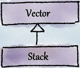

Dalam class Stack, terdapat fungsi standar sebuah stack LIFO yaitu pop, push, dan peek.

```java
public void push(E data) {
  this.add(data);
}

public void pop() {
  this.removeElementAt(this.size()-1);
}

public E peek() {
  return this.elementAt(this.size()-1);
}
```

Namun dalam class Vector, beberapa method yang seharusnya diaplikasikan dari Vector sebagai berikut:

```java
@Override
public synchronized void add(int index, E element) {
  return super.add(index, element);
}

@Override
public synchronized E remove(int index) {
  return super.remove(index);
}
```

Malah ditolak oleh Stack dengan throw exception/return null karena tidak boleh return sembarang value.

```java
/*
* you cannot add or remove by index, use push/pop instead
*/
@Override
public synchronized void add(int index, E element) {
  throw new Exception("You can't add element at random index!");
}

@Override
public synchronized E remove(int index) {
  return null;
}
```

Smell ini tentunya saling bersebrangan dengan **Rebellious Hierarchy** namun disebabkan oleh hubungan relasi yang salah antara superclass dan subclass yang salah dan hubungan `has-a` yang dipaksakan sebagai hubungan `is-a` sehingga terdapat beberapa method ditolak oleh subclass.


Sebagai solusinya, ubah hubungan `is-a` yang terjadi antara kedua class tersebut sebagai hubungan delegatif (`has-a`) sehingga `Stack` dapat memanfaatkan `Vector` sebagai media penampungan dan mendelegasikan setiap kebutuhan dari `Stack` kepada `Vector`, namun tidak terakses oleh class lain.

```java
public class Stack<E> {
  private Vector<E> stack = new Vector<>();

  public void push(E data) {
    stack.add(data);
  }

  public void pop() {
    stack.removeElementAt(stack.size()-1);
  }

  public E peek() {
    return stack.elementAt(stack.size()-1);
  }
}
```

Pada class `Vector` hasil perubahan relationship, fungsi-fungsi Stack LIFO yaitu pop, push, dan peek didelegasikan ke Vector untuk add/remove/get object sesuai kebutuhan `Stack` itu sendiri.


## Multipath Hierarchy

[Link Video](#) |
[Materi](#)

> Tamika adalah anaknya pak Joni & ibu Mimi serta cucunya kakek Sugiono. Tamika sendiri dilahirkan dan diwariskan oleh ayah dan ibunya. Namun pada suatu ketika ia ingin belajar dari kakeknya sehingga ia nekat ambil jalan pintas ilmunya *(jalan ninja)* dari Kakek Sugiono padahal bapaknya Tamika sendiri adalah anaknya Kakek Sugiono yang ilmunya sama-sama diwariskan darinya. Lah kalau ilmunya bapaknya sendiri datang dari kakeknya, kenapa gak belajar langsung aja dari bapaknya? Kan gak perlu capek-capek cari ilmu ke kakek Sugiono hanya ingin cepat jago. :joy:

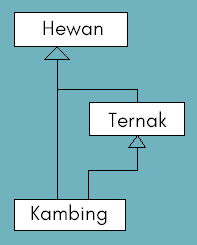

Smell ini terjadi ketika terdapat class yang mengambil jalan pintas inheritance ke base class tertingginya padahal ia sendiri merupakan keturunan dari base class itu sendiri. Hal tersebut tentunya mengakibatkan adanya *inheritance redundancy* dikarenakan jalan pintas inheritance dari class ke base class tertingginya.

Smell ini tidak dapat disandingkan dengan **Diamond Hierarchy** dimana pada kasus tersebut, sebuah class pada hierarki tersebut merupakan turunan dari 2 type yang sama-sama diwariskan dari base type itu sendiri. Pada kasus **Diamond Hierarchy**, menghilangkan salah satu inheritancy dari class tersebut dapat merubah isi struktural dari class tersebut.

### Penyebab

- **Overlooking existing inheritance paths**: Terlalu niat melihat jalur inheritance sehingga mengambil jalan pintas padahal sama-sama keturunan dari base type itu sendiri.

### Penyelesaian

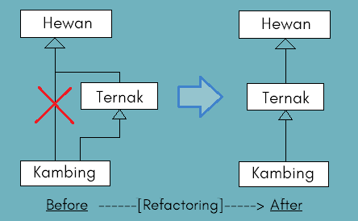

Buang implementasi turunan base class tertingginya dari class tersebut jika ada inheritance base class yang merupakan turunan dari base class tertingginya.

### Contoh

Misal dalam class `java.util.concurrent.ConcurrentLinkedQueue` dimana class tersebut mengimplementasikan interface `java.util.Queue`. Namun class tersebut melakukan extend pada `java.util.AbstractQueue` dimana class tersebut merupakan implementasi dari interface `java.util.Queue` sehingga implementasi interface `java.util.Queue` menjadi redundant karena sudah diturunkan oleh `AbstractQueue`.

Cara termudah dan paling instan dalam menyelesaikan kasus smell ini adalah dengan membuang jalan pintas inheritance yaitu `java.util.Queue` sehingga tidak ada jalan pintas inheritance dari hierarki tersebut.

### Julukan

- **Degenerate inheritance**: Class diturunkan langsung dan tidak langsung dari superclass (baik melalui intermediate class maupun langsung kepada superclassnya).
- **Repeated inheritance**: Class diturunkan dari turunannya yang sama berulang kali melalui jalur yang berbeda.


## Cyclic Hierarchy

[Link Video](#) |
[Materi](#)

> Lagi.. Mama-nya minta duit dulu sama anaknya.. Emangnya mama ngutang apa sampai harus minta duit anaknya? Kan mama yang kasih jatah uang jajan sembari biayai kuliah dan kos aku selama kuliah? :frowning:

Smell ini terjadi karena adanya perputaran/cyclic dependency (baik langsung maupun tidak langsung) antara superclass dengan subclass.

Smell ini dapat terjadi karena:

- Supertype mempunyai object dari salah satu subtype/turunannya.
- Supertype mempunyai hubungan tipe data salah satu subtype/turunannya.
- Supertype mengakses data members atau memanggil method dalam subtype/turunannya.

### Penyebab

- **Improper assignment of responsibilities**: Kurang jelasnya dalam menentukan tanggung jawab terhadap class-class dalam hierarki dimana pada kasus tertentu, superclass memanggil subclass karena adanya pertanggungjawaban superclass dari subclass.
- **Hard-to-visualize indirect dependencies**: Sulitnya melihat dependensi tidak langsung menyebabkan developer menganggap bahwa class-class dalam hierarki tersebut tampak tidak bergantung secara langsung, padahal masih ada cyclic dalam hierarki karena adanya dependensi berantai antar class dari superclass terhadap subclass.

### Penyelesaian

Ada beberapa cara penyelesaian Cyclic Hierarchy diantaranya:

- Buang referensi penghubung antar keduanya jika hubungan superclass dan subclass terasa tidak penting/diperlukan.
- Usahakan untuk move method/extract class agar tidak terjadi cyclic antar kedua class.
- Gunakan State patterns atau Strategy patterns jika superclass memerlukan bantuan dari subclass.
- Gabungkan jika superclass dan subclass saling bergantung satu sama lain.

### Contoh

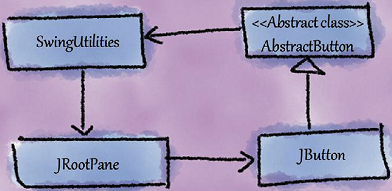

Pada kasus hierarki antara `AbstractButton` sebagai superclass dan `JButton` sebagai subclass, terdapat kasus dimana `AbstractButton` bergantung pada `JButton` meski tidak langsung. Kasus ini terjadi karena terdapat method dalam `AbstractButton` yang memanggil `SwingUtilities`, dimana class tersebut secara tidak langsung bergantung pada `JRootPane` yang mempunyai elemen `JButton`.

Meski ketergantungan class ini boleh dikatakan terjadi secara tidak langsung, namun hal ini tidak boleh disepelekan dimana pada kasus ini dapat berakibat Cyclic Dependency antar superclass dan subclass.

Sebagai jalan penyelesaiannya, terdapat salah satu static method dalam class `SwingUtilities` yang mengakses `JRootPane`, yaitu `SwingUtilities.getRootPane()` yang sebetulnya dapat dipisahkan/diekstrak ke class lain *(misal: ComponentUtilities)* sehingga dependensi superclass terhadap subclass dapat terpecahkan.

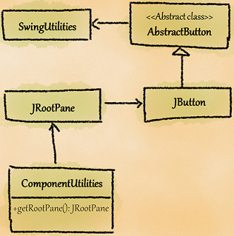

### Julukan

- **Knows of derived**: Terjadi ketika superclass mempunyai dependensi (baik langsung/tidak langsung) terhadap turunan saat compile (baik melalui `import`, parameter, deklarasi, maupun object).
- **Curious superclasses**: Superclass memanggil/mempunyai member dari subclass.
- **Inheritance/reference cycles**: Superclass mempunyai hubungan terhadap turunannya (sehingga terjadi inheritance/reference cyclics).
- **Descendant reference**: Class mempunyai hubungan terhadap turunannya melalui hubungan asosiasi, dependensi, attribute, atau parameter.
- **Superclass uses subclass during initialization**: Class memanggil class turunannya saat inisialisasi.
- **Inheritance loops**: Smell terjadi (misal terdapat class A, B, and C) dimana A merupakan turunan dari C, B merupakan turunan dari A, dan C merupakan turunan dari B meski tidak terjadi secara langsung antara A dan B.

---

### Referensi Bacaan

Wiki dan repository ini hanyalah rangkuman dari buku Suryanarayana et al. dengan sedikit tambahan informasi lain. Diharapkan mahasiswa juga membaca sumber aslinya pada bab 6 halaman 123 - 192.

Untuk referensi teknik refactoring dapat diakses melalui [sourcemaking](https://sourcemaking.com/refactoring/refactorings) (dalam artikel ini) atau [refactoring.guru](https://refactoring.guru/refactoring/techniques) (ganti URL `sourcemaking.com/refactoring/<teknik-refactoring>` ke `refactoring.guru/<teknik-refactoring>`).

Untuk referensi tambahan mengenai materi modularization, terutama pada topik tertentu, dapat disimak pada referensi berikut:

- Martin Lippert and Stephen Roock, "Refactoring in Large Software Projects," Bab 3, hal 35-52. John Wiley & Sons. 2006. ISBN: 9780470858936
