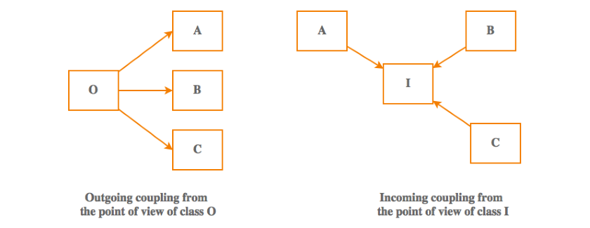

# Hub-like Dependencies

[Link Video](https://www.youtube.com/watch?v=ImUM8T-1fy4&list=PLG_Cu5FmqSk2KHT6lXngRvcOmOzuk4_ju)



Smell ini terjadi ketika sebuah abstraksi mempunyai banyak dependensi masukan (fan-in) dan/atau abstraksi tersebut bergantung banyak pada abstraksi lain (fan-out). Smell ini sering kali memiliki kombinasi dengan smell lain seperti Large Class/Insufficient Modularization, Divergent Changes, dan Broken Modularization. Smell ini tentunya melanggar Single Responsibility Principle (SRP) karena banyaknya tanggungjawab yang dibebani olehnya.

### Penyebab

- **Improper responsibility assignment (to hub class)**: Dikarenakan abstraksi tersebut banyaknya tanggungjawab dan kadangkala harus berkomunikasi dengan class lain.
- **“Dump-all” utility classes**: Developer membuat sebuah class *Helper* agar class lain dapat memanfaatkan utility yang diperlukan dari *Helper* class tersebut.

### Contoh

#### Kasus class `java.awt.Font` dan `java.util.Component`

Pada buku ini, disebutkan bahwa Girish menyinggung 2 class besar yang mempunyai smell ini, yaitu class `java.awt.Font` dan `java.util.Component`.

Pada kasus smell class `java.awt.Font`, class ini merupakan class yang merepresentasikan font dan fungsionalitas untuk render text sebagai kumpulan abjad/karakter pada object `Graphic` dan `Component`. Smell ini terjadi karena terhitung ada 19 incoming dependencies (fan-in) dan 34 outgoing dependencies (fan-out). Tentunya jumlah dependensi dalam class ini terbilang cukup banyak karena adanya text drawing dalam komponen-komponen di Java.

Pada kasus smell class `java.util.Component`, class ini berisikan konsep object grafis yang dapat ditampilkan pada layar, baik sebagai button, panel, dan scroll bar. Secara definitif, class ini merupakan fondasi penting dalam pengembangan user interface dalam bahasa pemrograman Java. Smell ini terjadi karena terhitung ada 498 incoming dependencies (fan-in termasuk `java.awt.Font`) dan 71 outgoing dependencies (fan-out).

Kedua class besar ini juga belum dihitung jumlah dependensi secara implisit (method implementasi dalam class), dan tentunya memperbludak class management karena banyaknya dependensi yang harus diurus oleh class tersebut.

#### Kasus utility class

Diketahui sebuah class bernama [Utility.java](before/Utility.java) dimana pada class tersebut berisikan berbagai macam jenis utility yang dapat dipergunakan oleh class lain.

```java
public class Utilities {
  public static boolean validateEmail(String email) { ... }
  public static boolean validatePhoneNumber(String phoneNumber) { ... }

  //... other validation methods

  public static String toTitleCase(String s) { ... }

  //... other string manipulation methods
}
```

Ternyata class tersebut tidak hanya bertanggungjawab atas validasi, namun juga pada manipulasi teks dan fitur-fitur pembantu lainnya sehingga menimbulkan smell hub-like modularization dan Large Class karena adanya pemakaian oleh beberapa class lainnya.

### Penyelesaian

- Jika class tersebut mempunyai tanggungjawab yang banyak, disarankan untuk memecahkan menjadi beberapa class dengan [Extract Class](https://refactoring.guru/extract-class).
- Jika dependensi class disebabkan karena salah tempat, pindahkan member tersebut ke class yang bersangkutan.
- Gunakan design pattern yang tepat untuk mengurangi jumlah dependensi class, salah satunya adalah [Chain of Responsibility](https://refactoring.guru/design-patterns/chain-of-responsibility) dimana class tersebut berfungsi untuk melakukan pemanggilan berantai antar class atau alternatifnya, menggunakan design pattern [Observer](https://refactoring.guru/design-patterns/observer) dimana class tersebut berfungsi untuk melakukan panggilan kepada class yang diaggregatnya.

#### Penyelesaian pada kasus `java.awt.Font`

Salah satu sugesti dari Girish adalah dengan memindahkan class, dikarenakan adanya beberapa class yang mempunyai member (baik method dan attribute) yang dapat tempatkan pada class yang seharusnya, salah satunya adalah method `createGlyphVector()` yang mempunyai smell Feature Envy dimana method ini berfungsi hanya untuk mengakses class `GlyphVector` dan membuat object dari class tersebut.

```java
public GlyphVector createGlyphVector(FontRenderContext frc. CharacterIterator ci) {
  return (GlyphVector) new StandardGlyphVector(this, ci, frc);
}
```

Salah satu saran refactoring adalah dengan memindahkannya ke class `GlyphVector` sehingga class yang bergantung pada method tersebut dapat mengakses langsung pada class `GlyphVector`.

#### Penyelesaian pada kasus utility class

```java
public class Utilities {
  public static String toTitleCase(String s) { ... }
  public static boolean validatePhoneNumber(String phoneNumber) { ... }

  //... other string manipulation methods
}

public class Validation {
  public static boolean validateEmail(String email) { ... }

  //... other validation methods
}
```

Class `Utility` memegang tanggung jawab lebih dari 1 yaitu validasi dan string manipulation, oleh karenanya diperlukan extract class ke class baru bernama [Validation.java](after/Validation.java) untuk keperluan sehingga pada class [Utility.java](after/Utility.java) cukup dipakai untuk keperluan string manipulation.

### Julukan

- **Bottlenecks**: Ada class yang banyak dipakai kepada class lain.
- **Local hubs**: Sebuah abstraksi punya banyak dependensi dan dipakai oleh banyak class.
- **Man-in-the-middle**: Terdapat central class dalam hierarki abstraksi yang sering dimanfaatkan sebagai mediator oleh class lain.

### When to Ignore

Pada kasus-kasus aplikasi berskala besar, terkadang ada beberapa *core abstractions* dimana class tersebut berperan penting dalam aplikasi. Salah satu contoh class bertipekan core abstraction adalah `java.lang.Class` dimana class ini menjadi pusat abstraksi di JDK dimana class ini dipakai oleh >1000 class dan bergantung pada 40 class. Meski class ini dapat dicap mempunyai smell Hub-like Modularization smell, namun kasus ini sangat tidak memungkinkan untuk dibatasi jumlahnya karena fungsionalitas yang sangat penting bagi class lain.
